https://diegoale8504.atlassian.net/jira/software/projects/AJIACO/boards/34?atlOrigin=eyJpIjoiNWU5ODY2NjY5N2IxNDI2YmIwM2YwYTMzYTJjOWQxODQiLCJwIjoiaiJ9

## Preparar un ajiaco para el dia de la madre
se debe de hacer para antes del 8 de mayo, ya que ese dia es el dia de la madre,
el sancocho es para 25 personas y tenemos que tener en cuenta cuales son las alergias
de las personas

## Jira
### Epica y descripcion: 

## Features, historias de usuarios y tareas a realizar
### Feature 1
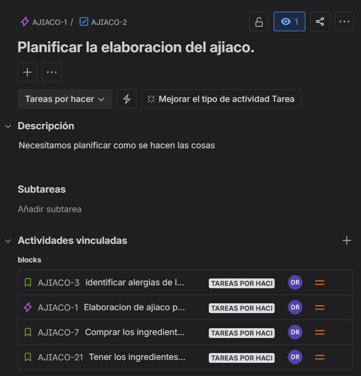
- Historia de usuario
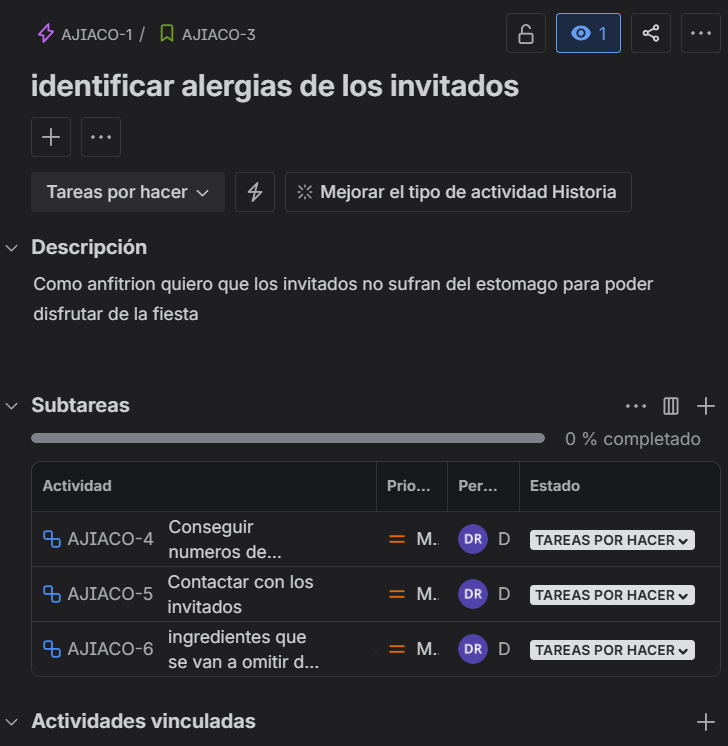
- Tareas de la historia de usuario
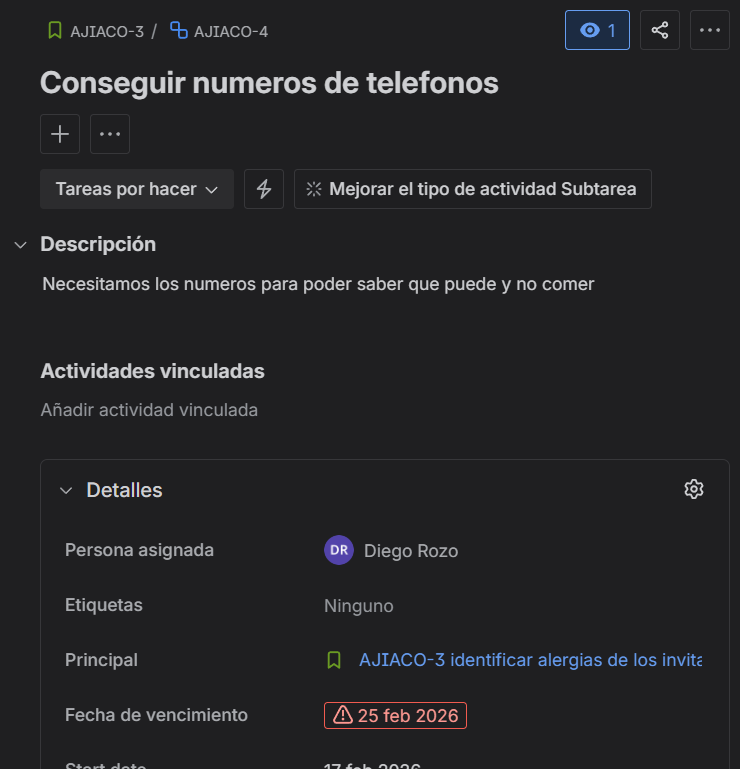
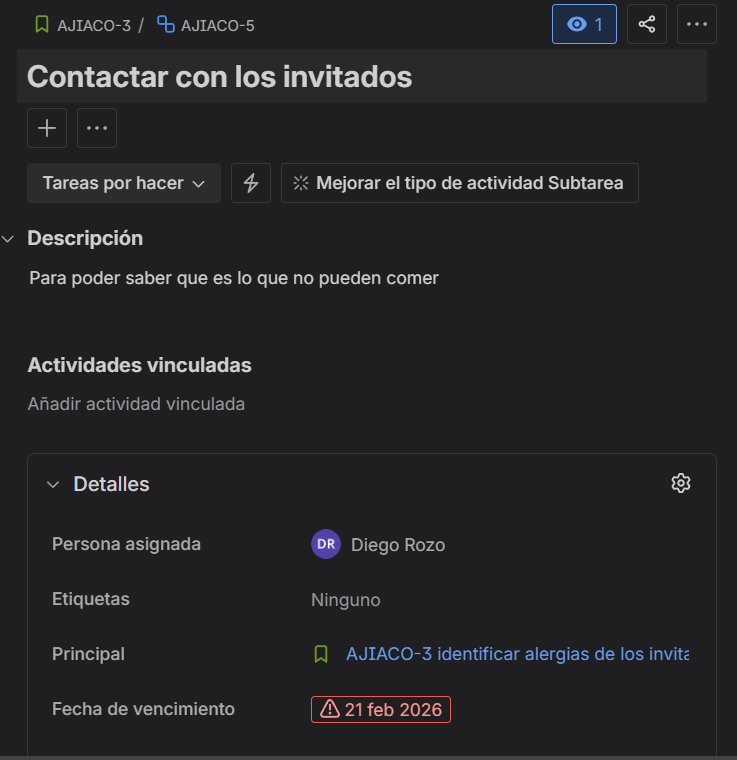

- historia de usuario

- tareas

### Feature 2

- Historia de usuario

- Taras de la historia de usuario

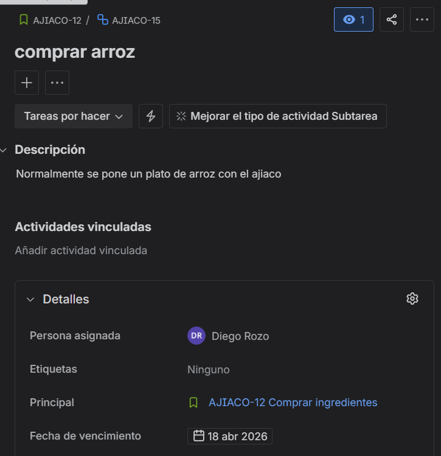
- Historia de usuario
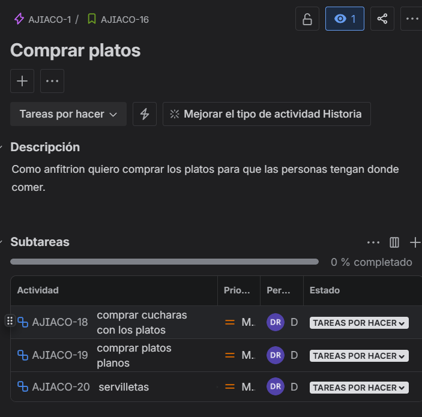
- Tareas

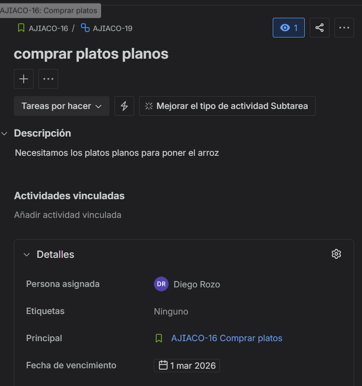
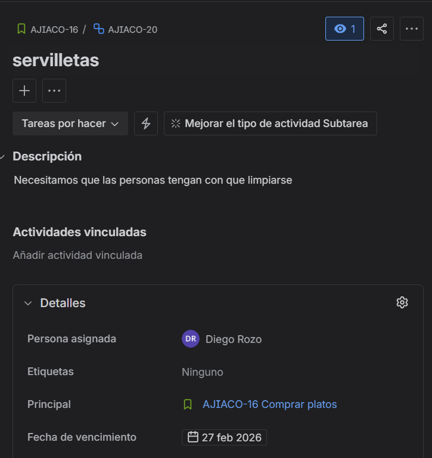
### Feature 3
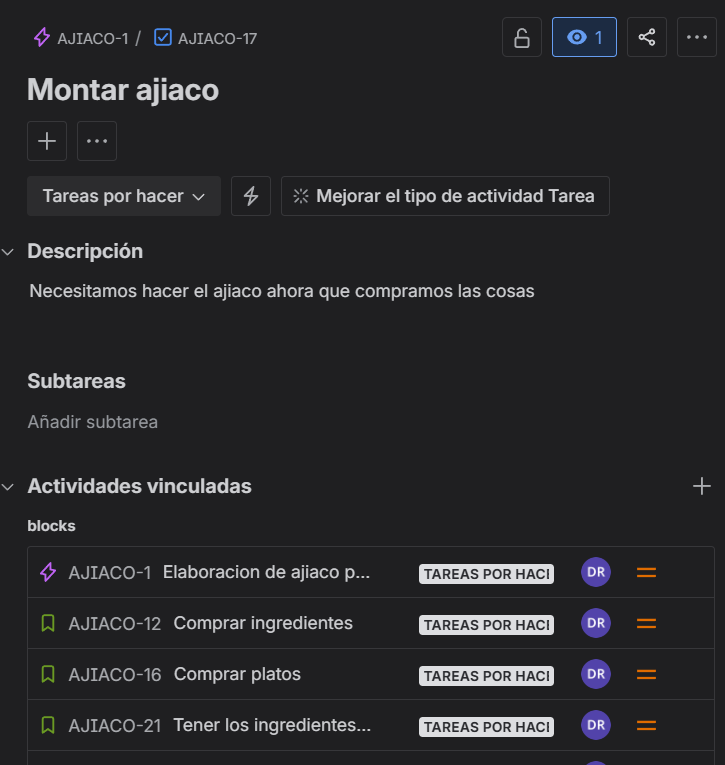
- Historias de Usuario
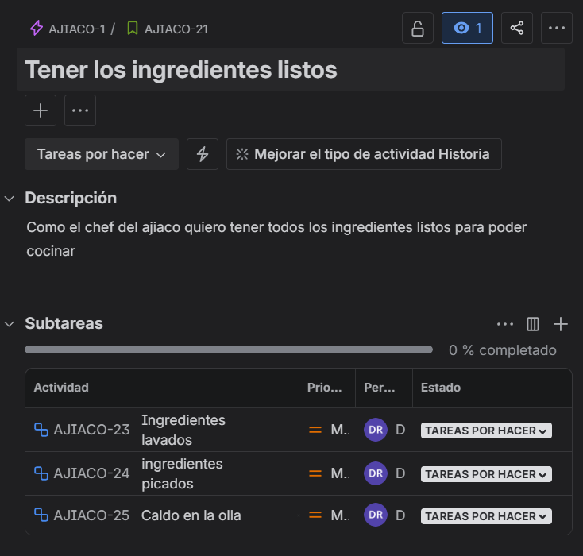
- Tareas

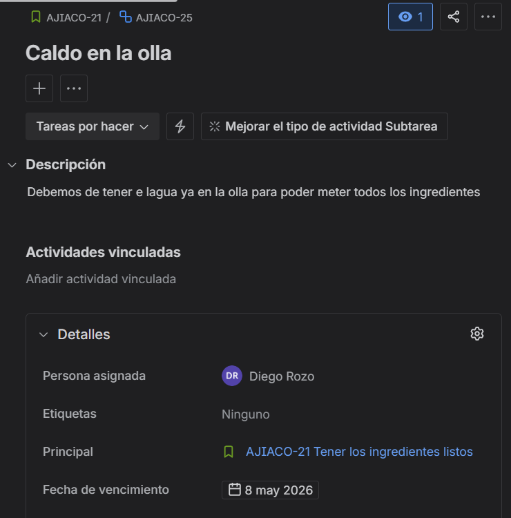
- Historia de usuario
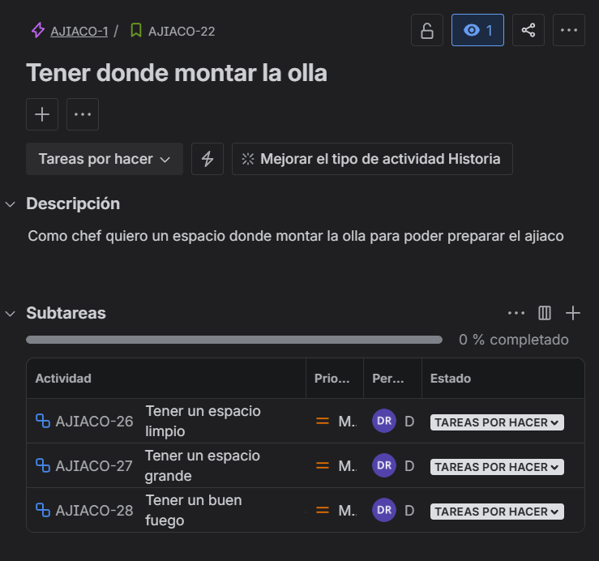
- Tareas
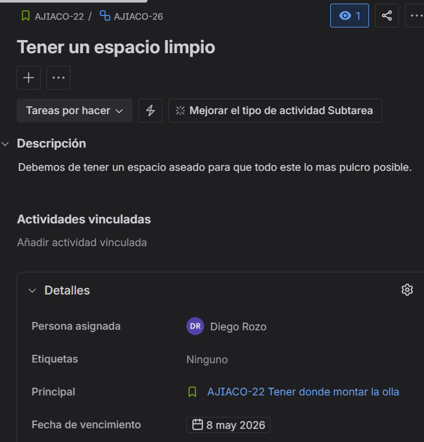
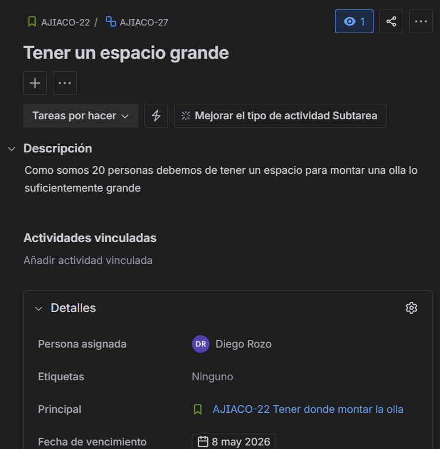
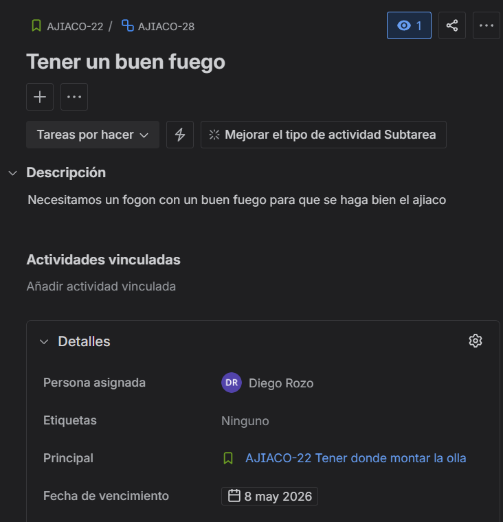
### Feature 4
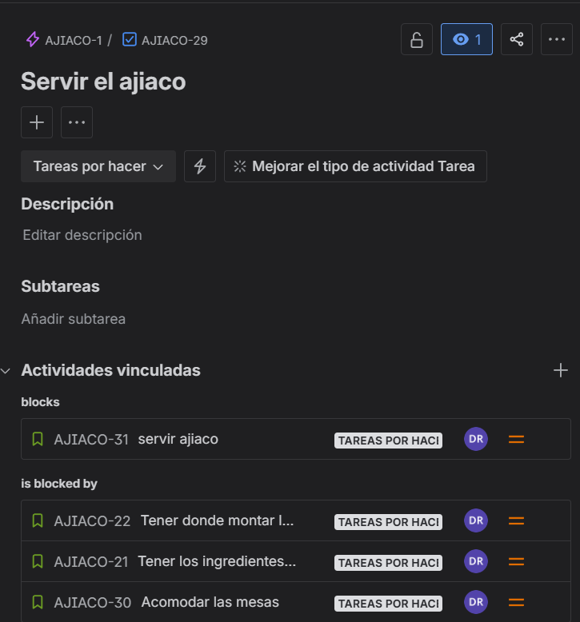
- Historia de usuario
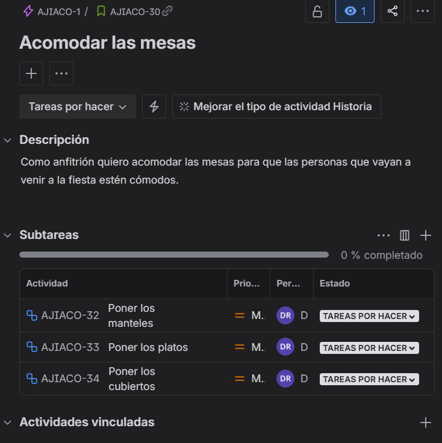
- Tareas
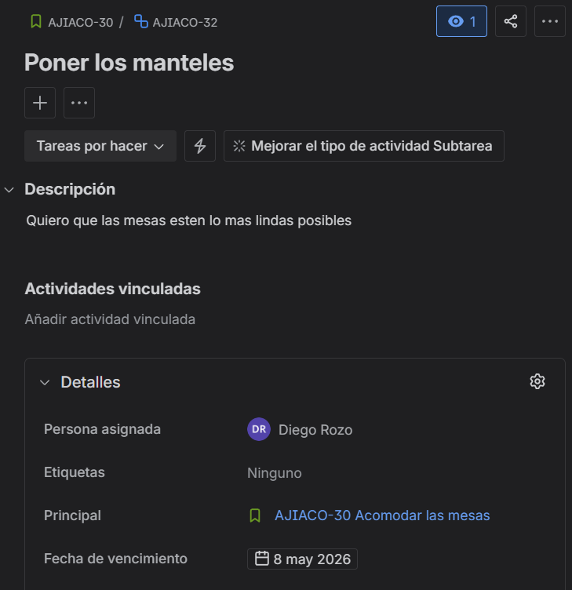

