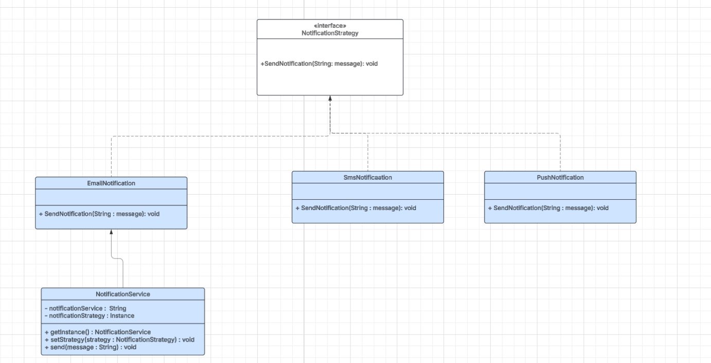

### Patrón 1

Nombre del patrón: Strategy
Tipo: Comportamiento
Justificación técnica:
Permite cambiar dinámicamente el algoritmo de envío de notificaciones dependiendo del canal (Email, SMS, Push) sin modificar el código del cliente.

### Patrón 2

Nombre del patrón: Singleton
Tipo: Creacional
Justificación técnica:
Garantiza que el servicio de notificaciones tenga una sola instancia en todo el sistema.